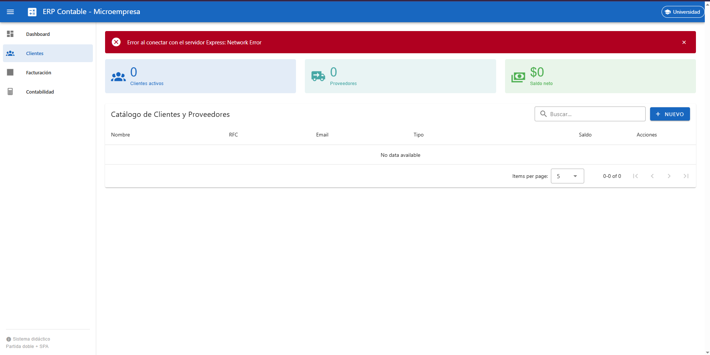
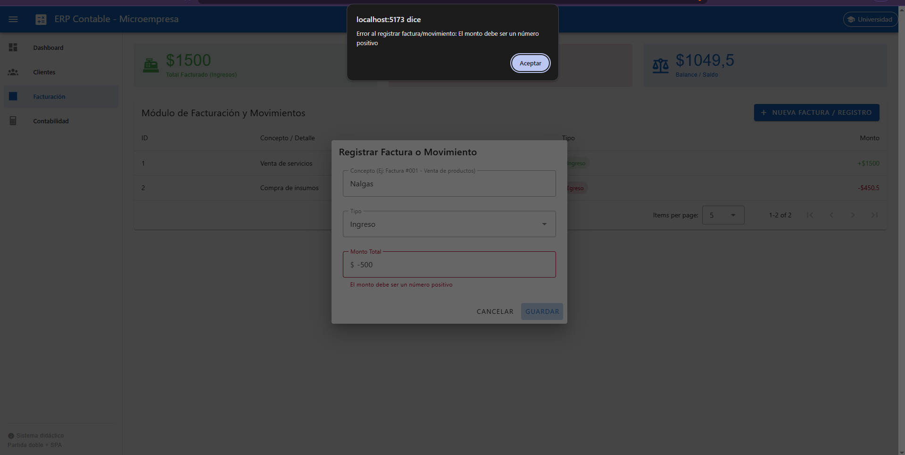

# Investigación Individual - Semana 8

## 1. Simulación de Servidor Caído
- **Procedimiento:** Se detuvo el servidor Express (`Ctrl + C`) y se recargó la aplicación en Vue.
- **Error en Consola:** Se genera un error de red (`ERR_CONNECTION_REFUSED`) en Axios.
- **Respuesta de la UI:** La aplicación captura el error en el bloque `catch` y asigna el mensaje: *"El servidor no responde. Verifica que esté encendido."*, evitando que la aplicación colapse.



## 2. Manejo de Errores HTTP 400
- **Procedimiento:** Se intentó registrar un movimiento con un monto negativo.
- **Manejo en UI:** Axios recibe una respuesta con código de estado 400 y atrapa `err.response.data.mensaje`.
- **Mensaje mostrado:** La UI refleja exactamente el mensaje provisto por el backend: *"El monto debe ser un número positivo."*



## 3. Carga Simultánea con Promise.all
Para cargar contactos y movimientos al mismo tiempo reduciendo el tiempo de espera, se usa `Promise.all`:

```javascript
async function cargarTodo() {
  cargando.value = true;
  error.value = null;
  try {
    const [resMovimientos, resContactos] = await Promise.all([
      movimientoService.getAll(),
      api.get('/contactos')
    ]);
    movimientos.value = resMovimientos.data.datos;
    contactos.value = resContactos.data.datos;
  } catch (err) {
    error.value = 'Error al cargar los datos simultáneos.';
  } finally {
    cargando.value = false;
  }
}
